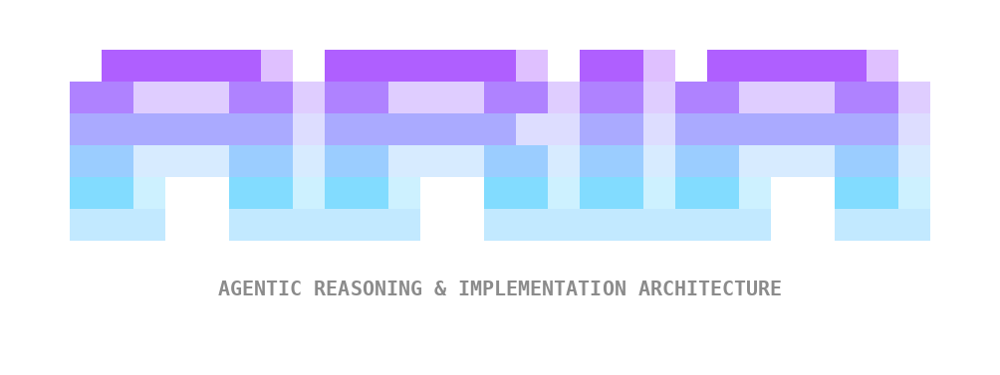

<div align="center" markdown>



**Multi-platform agentic development with musical-themed AI agents.**

</div>

ARIA (Agentic Reasoning & Implementation Architecture) brings 12 AI agent personas to your project management platform. Instead of writing artefacts to local files, agents create and manage Epics, Stories, Sprints, Milestones, Releases, and Documents across Plane or Linear via native MCP tools.

---

## What It Does

ARIA guides your project through a structured 5-phase scrum workflow:

1. **Analysis** -- Cadence brainstorms ideas, creates product briefs and research documents
2. **Planning** -- Maestro creates PRDs and defines Epics & Stories; Lyric creates UX design docs
3. **Solutioning** -- Opus creates architecture decisions; Forte performs security reviews; Harmony models data; Maestro validates implementation readiness
4. **Implementation** -- Tempo manages sprints with capacity planning; Riff implements code; Pitch reviews and tests
5. **Release** -- Coda plans releases, designs CI/CD pipelines, and defines deployment strategies

An automated **orchestrator** polls platform state to determine which agent should work next, enabling autonomous project progression.

---

## Key Features

- **Cross-phase context retrieval** -- any agent can pull artefacts from any previous phase on demand. The developer reads the architect's design rationale. QA checks the PRD's acceptance criteria. Security reviews the data model. Every decision persists on the platform and is available to every agent throughout the entire project lifecycle.
- **38 slash commands** -- type `/aria` in Claude Code and autocomplete to any workflow
- **12 musical agent personas** -- each with distinct capabilities, communication styles, and workflows
- **Multi-platform tracking** -- Epics, Stories, Sprints, Milestones, and Documents managed via Plane or Linear MCP tools
- **Scrum practices** -- Fibonacci estimation, velocity tracking, sprint capacity, backlog refinement
- **Structured handoffs** -- mandatory context passing with decisions, questions, and artefact references
- **Automated orchestrator** -- polls platform state and dispatches agents autonomously
- **Optional Git/GitHub integration** -- branches, commits, and PRs aligned with work items
- **Simplified setup** -- 3-4 essential questions, everything else auto-discovered

---

## Quick Start

Paste into any AI coding tool:

> Read the instructions at https://raw.githubusercontent.com/JacobWLMS/ARIA/main/agent-install.md and follow them to install ARIA into this project.

Or install via shell:

```bash
curl -fsSL https://raw.githubusercontent.com/JacobWLMS/ARIA/main/install.sh | bash
```

Or clone and install:

```bash
git clone https://github.com/JacobWLMS/ARIA.git
cd ARIA
./install.sh
```

Then:

1. Run `/aria-setup` to select your platform (Plane or Linear) and auto-discover your team
2. Run `/aria-git` to configure Git/GitHub integration (optional)
3. Run `/aria-help` to get started

[**Get Started →**](getting-started/index.md)

---

## Links

- [GitHub Repository](https://github.com/JacobWLMS/ARIA)
- [BMAD-METHOD (upstream)](https://github.com/bmadcode/BMAD-METHOD)
