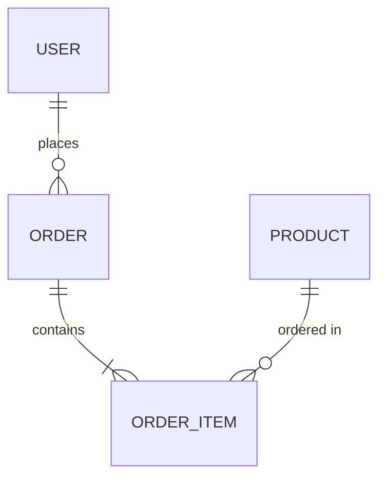

# Data Model — Document Output

<critical>You MUST have already loaded and processed: the workflow.yaml for this workflow</critical>

## Overview

Creates a comprehensive data model through collaborative discovery — entity definitions, relationships, constraints, indexes, and a Mermaid ERD. All output is written to a document. After creation, posts a handoff to the Architect (Opus) for integration with the architecture document.

## Execution Rules

- NEVER generate content without user input — you are a facilitator, not a content generator
- ALWAYS treat this as collaborative discovery between data engineering peers
- ABSOLUTELY NO TIME ESTIMATES — AI development speed has fundamentally changed
- ALWAYS speak in {communication_language}
- Show your analysis before taking any action
- At each step boundary, present the A/P/C menu and WAIT for the user's selection before proceeding
- Autonomy: when `autonomy_level` is `yolo`, auto-proceed on obvious steps; when `balanced`, auto-proceed only when unambiguous; when `interactive`, always wait for explicit user input

## A/P/C Menu Protocol (used in steps 2-6)

After generating content in each step, present:
- **[A] Advanced Elicitation** — Invoke `{project-root}/_aria/shared/tasks/advanced-elicitation.md`, then return to this menu with refined content
- **[P] Party Mode** — Invoke `{project-root}/_aria/shared/workflows/party-mode/instructions.md`, then return to this menu with enhanced analysis
- **[C] Continue** — Accept the content and proceed to the next step

User accepts/rejects A or P results before proceeding. FORBIDDEN to advance until C is selected.

---

<workflow>

<step n="1" goal="Initialize and load context from the platform">

<action>Communicate in {communication_language} with {user_name}</action>

**1A. Check for existing data model:**

<action>Invoke the `read-context` task from `{project-root}/_aria/core/tasks/read-context.md` with `context_type: "document_artefact"` and `query: "Data Model"` to search for documents with "Data Model" in the title</action>

If found, present continuation menu:

"Welcome back {user_name}! I found your existing Data Model work for {project_name}.
- **[R] Resume** — Continue from where we left off
- **[C] Continue** — Jump to the next logical step
- **[O] Overview** — See all remaining steps
- **[X] Start over** — Begin fresh (creates a new document)"

R/C: Read existing document via the `read-context` task, analyse what sections are complete, jump to next incomplete step. O: List all 7 steps with descriptions, let user choose. X: Confirm with user, then proceed with fresh setup below.

**1B. Load project context:**

<action>Invoke the `read-context` task from `{project-root}/_aria/core/tasks/read-context.md` with `context_type: "project_overview"`</action>
<action>Invoke the `read-context` task with `context_type: "document_artefact"` and `scope_id: "prd"` — REQUIRED</action>
<action>Invoke the `read-context` task with `context_type: "document_artefact"` and `scope_id: "architecture"` — REQUIRED</action>
<action>Invoke the `read-context` task with `context_type: "document_artefact"` and `scope_id: "product_brief"` (optional)</action>

If no PRD found: "Data modeling requires a PRD. Please run the PRD workflow first." Do NOT proceed without PRD.
If no architecture found: warn user but allow proceeding — architecture integration will be limited.

**1C. Load template:**

<action>Load data model template from `{template}`</action>

**1D. Report and confirm:**

"Welcome {user_name}! Data modeling workspace ready for {project_name}.

**Documents Loaded:**
- PRD: {status}
- Architecture: {status}
- Product Brief: {status}

Do you have any additional context, existing schemas, or database preferences? **[C] Continue** to domain entity discovery"

**Success:** All artefacts loaded, PRD validated, user confirmed. **Failure:** Proceeding without PRD, not checking for existing data model.
</step>

<step n="2" goal="Domain entity discovery — identify all entities from PRD and architecture">

**2A. Extract entities from PRD:**

- Identify all nouns that represent persistent data (users, orders, products, etc.)
- Extract entity relationships implied by business rules
- Note entities implied by functional requirements (audit logs, notifications, sessions)
- Identify entities from user stories and acceptance criteria

**2B. Extract entities from architecture (if available):**

- Map architectural components to data entities
- Identify cross-cutting data needs (auth tokens, config, feature flags)
- Note external data integration points (third-party data, API responses to cache)

**2C. Classify entities:**

| Category | Examples |
|---|---|
| Core domain | Primary business entities (User, Order, Product) |
| Supporting | Secondary entities enabling core (Address, PaymentMethod) |
| Infrastructure | System-level (AuditLog, Session, Migration) |
| Reference | Lookup/config data (Country, Currency, Category) |
| Junction | M:N relationship tables (UserRole, OrderItem) |

**2D. Present entity inventory:**

"I've identified {entity_count} entities from your project documentation:

**Core Domain Entities:**
- {entity_name}: {brief description from PRD context}

**Supporting Entities:**
- {entity_name}: {brief description}

**Infrastructure Entities:**
- {entity_name}: {brief description}

**Reference Entities:**
- {entity_name}: {brief description}

Are there any missing entities? Any that should be removed or renamed?"

**2E. Generate content:**

```markdown
## Domain Overview

### Business Context
{summary of the domain from PRD and architecture}

### Entity Inventory
| Entity | Category | Description | Source |
|---|---|---|---|
| {name} | {category} | {description} | {PRD/Architecture/User} |
```

**Present A/P/C menu.** On C, hold content and proceed to step 3.

**Success:** All entities identified, classified, and validated by user. **Failure:** Missing entities from PRD, not classifying, not validating.
</step>

<step n="3" goal="Entity definitions — attributes, types, constraints for each entity">

**3A. For each entity, define:**

- **Primary key strategy:** UUID vs auto-increment vs composite, with rationale
- **Attributes:** Name, data type, nullable, default value, constraints
- **Standard fields:** created_at, updated_at, deleted_at (if soft delete), version (if optimistic locking)
- **Validation rules:** Length limits, format patterns, value ranges, uniqueness
- **Computed/derived fields:** Identify fields that can be computed vs stored

**3B. Data type conventions:**

Establish consistent conventions for the project:
- String lengths (short names vs descriptions vs text blocks)
- Numeric precision (money, percentages, quantities)
- Date/time handling (timezone strategy, UTC storage)
- Enum strategy (DB-level enum vs string with validation vs reference table)
- JSON/JSONB usage (when appropriate vs when to normalize)

**3C. Present entity definitions in groups** (core first, then supporting, etc.):

For each entity:
```markdown
### {EntityName}

{description and purpose}

| Attribute | Type | Nullable | Default | Constraints |
|---|---|---|---|---|
| id | UUID | NO | gen_random_uuid() | PK |
| {name} | {type} | {yes/no} | {default} | {constraints} |
| created_at | TIMESTAMPTZ | NO | NOW() | — |
| updated_at | TIMESTAMPTZ | NO | NOW() | — |
```

**Present A/P/C menu after each group.** On C, hold content and proceed to next group or step 4.

**Success:** All entities fully defined with types, constraints, and conventions established. **Failure:** Missing constraints, inconsistent type usage, no validation rules.
</step>

<step n="4" goal="Relationships — cardinality, foreign keys, and referential integrity">

**4A. Map all relationships:**

For each pair of related entities:
- Identify relationship type: 1:1, 1:N, M:N
- Determine direction and ownership (which entity holds the FK)
- Define ON DELETE behavior: CASCADE, SET NULL, RESTRICT, NO ACTION
- Define ON UPDATE behavior
- Note optional vs required relationships (nullable FK or not)

**4B. Handle M:N relationships:**

- Create explicit junction tables with composite PKs or surrogate PKs
- Define additional attributes on junction tables (e.g., quantity on OrderItem)
- Consider whether the junction entity is a first-class domain entity

**4C. Identify self-referencing relationships:**

- Hierarchical data (categories, org structures, comment threads)
- Choose representation: adjacency list, nested set, materialized path, closure table
- Document trade-offs for chosen approach

**4D. Present relationships:**

```markdown
## Relationships

| Entity A | Cardinality | Entity B | Foreign Key | On Delete | Notes |
|---|---|---|---|---|---|
| User | 1:N | Order | order.user_id | RESTRICT | User must exist |
| Order | 1:N | OrderItem | order_item.order_id | CASCADE | Items deleted with order |
```

**4E. Generate Mermaid ERD:**



Include all entities and relationships. Use correct Mermaid cardinality notation:
- `||--||` : one to one
- `||--o{` : one to zero or many
- `||--|{` : one to one or many
- `}o--o{` : zero or many to zero or many

**Present A/P/C menu.** On C, hold content and proceed to step 5.

**Success:** All relationships mapped with cardinality, FK placement, and delete behavior. ERD generated. **Failure:** Missing relationships, no delete behavior, incorrect cardinality.
</step>

<step n="5" goal="Indexes and query optimization">

**5A. Identify query patterns from PRD/architecture:**

- User-facing queries (search, filter, sort, pagination)
- System queries (scheduled jobs, reports, aggregations)
- API endpoint queries (list endpoints with filters, detail lookups)
- Auth queries (login, session validation, permission checks)

**5B. Design indexes for each pattern:**

| Table | Index Name | Columns | Type | Rationale |
|---|---|---|---|---|
| users | idx_users_email | email | UNIQUE BTREE | Login lookup, uniqueness |
| orders | idx_orders_user_created | user_id, created_at DESC | BTREE | User order history |

**5C. Consider advanced indexing:**

- Partial indexes (WHERE clause indexes for common filters)
- Expression indexes (LOWER(email) for case-insensitive search)
- GIN/GiST indexes (full-text search, JSONB, array columns)
- Covering indexes (INCLUDE columns to avoid table lookups)
- Composite index column ordering (selectivity-first strategy)

**5D. Anti-pattern check:**

- Over-indexing (too many indexes slow writes)
- Missing indexes on foreign keys (common oversight)
- Redundant indexes (compound index covers single-column queries)
- Wrong column order in composite indexes

**Present A/P/C menu.** On C, hold content and proceed to step 6.

**Success:** Indexes designed for all query patterns, anti-patterns checked. **Failure:** Missing FK indexes, no rationale, over-indexing.
</step>

<step n="6" goal="Data validation, multi-tenancy, and audit design">

**6A. Data validation rules:**

For each entity, define:
- Input validation (format, range, length, pattern)
- Business rule validation (state transitions, cross-field rules)
- Referential validation (FK existence, circular reference prevention)
- Uniqueness validation (natural keys, compound uniqueness)

**6B. Multi-tenancy strategy (if applicable):**

Evaluate and recommend:
- **Shared database, shared schema:** tenant_id column on every table (simplest)
- **Shared database, separate schemas:** Schema per tenant (isolation)
- **Separate databases:** Database per tenant (strongest isolation)

Document: tenant isolation level, data access patterns, row-level security policies.

**6C. Audit trail design (if applicable):**

- What to track: creates, updates, deletes, reads (if sensitive)
- Audit table design: entity, entity_id, action, old_value, new_value, actor, timestamp
- Retention policy: how long to keep audit records
- Performance: async audit logging vs synchronous

**6D. Soft delete strategy (if applicable):**

- deleted_at TIMESTAMPTZ column approach
- Unique constraint handling with soft deletes (partial unique indexes)
- Query patterns (default exclusion of deleted records)
- Restoration procedure

**6E. Migration notes for existing data (if applicable):**

- Seed data requirements (reference tables, default records)
- Data transformation from legacy systems
- Backfill strategies for new columns

**Present A/P/C menu.** On C, hold content and proceed to step 7.

**Success:** Validation rules defined, cross-cutting concerns addressed. **Failure:** Missing validation, no multi-tenancy consideration, no audit design.
</step>

<step n="7" goal="Write data model to document, link to projects, and hand off">

**7A. Celebrate completion** — summarise what was accomplished: entity count, relationship count, key design decisions, how the data model serves the project.

**7B. Compile the complete data model document:**

<action>Compile using template at `{template}`, incorporating all content from steps 2-6 in order:</action>

1. Domain Overview (step 2)
2. Entity Definitions (step 3)
3. Relationships (step 4)
4. Entity-Relationship Diagram (step 4 — Mermaid)
5. Indexes (step 5)
6. Data Validation Rules (step 6)
7. Multi-tenancy / Audit / Migration sections (step 6)

<action>Generate in {document_output_language}</action>

**7C. Write to document:**

<action>Invoke the `write-document` task from `{project-root}/_aria/core/tasks/write-document.md` with:</action>

```
title: "[{team_name}] Data Model: {project_name}"
body_content: "{compiled_data_model_content}"
key_map_id: "data_model"
```

<action>Update `{key_map_file}` with new document ID under `documents.data_model`</action>

**7D. Link data model to Projects (if applicable):**

<action>Call `list_projects` with `team: "{team_name}"` to find all ARIA projects</action>
<action>For each relevant Project, invoke the platform's project update to update the description with a Data Model link</action>

**7E. Post handoff:**

<action>Invoke the `post-handoff` task from `{project-root}/_aria/core/tasks/post-handoff.md` with:</action>

```
handoff_to: "Architect"
handoff_type: "data_model_complete"
summary: "Data model created and published to document. {entity_count} entities, {relationship_count} relationships defined. Ready for architecture integration."
document_id: "{data_model_document_id}"
```

**7F. Report to user:**

**Data Model Complete**
- **document:** {data_model_document_title}
- **Status:** Published
- **Entities Defined:** {entity_count}
- **Relationships Mapped:** {relationship_count}
- **Indexes Designed:** {index_count}
- **Handoff:** Architect (Opus) notified

**Next Steps:**
1. Review the data model in documents
2. Architect can integrate with architecture document
3. Run Data Pipeline Design [DPP] if ETL/ELT is needed
4. Run Data Migration Plan [DMG] if migrating from existing data

<action>Invoke the help task at `{project-root}/_aria/core/tasks/help.md`</action>

**Success:** Document published, Projects linked, Architect notified, next steps provided. **Failure:** Not publishing, missing links, no handoff.
</step>

</workflow>
