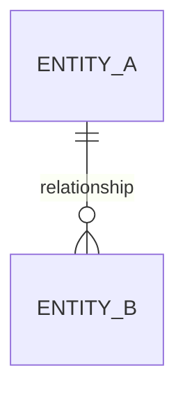

# Data Model: {{project_name}}

| Field | Value |
|---|---|
| **Project** | {{project_name}} |
| **Date** | {{date}} |
| **Author** | {{user_name}} (with Harmony, Data Engineer) |
| **Version** | 1.0 |

---

## Domain Overview

### Business Context

_Summary of the business domain, key processes, and how data flows through the system._

### Key Entities Summary

| Entity | Category | Description |
|---|---|---|
| | | |

---

## Entity Definitions

_For each entity: name, description, attributes with types, constraints, and validation rules._

### {{EntityName}}

_Description and purpose of this entity._

| Attribute | Type | Nullable | Default | Constraints |
|---|---|---|---|---|
| id | UUID | NO | gen_random_uuid() | PK |
| created_at | TIMESTAMPTZ | NO | NOW() | — |
| updated_at | TIMESTAMPTZ | NO | NOW() | — |

---

## Relationships

| Entity A | Cardinality | Entity B | Foreign Key | On Delete | Notes |
|---|---|---|---|---|---|
| | | | | | |

---

## Entity-Relationship Diagram

---

## Indexes

| Table | Index Name | Columns | Type | Rationale |
|---|---|---|---|---|
| | | | | |

---

## Data Validation Rules

_Input validation, business rule validation, referential validation, and uniqueness constraints._

### Input Validation

| Entity | Field | Rule | Error Message |
|---|---|---|---|
| | | | |

### Business Rule Validation

| Rule | Entities | Description | Enforcement |
|---|---|---|---|
| | | | |

---

## Multi-tenancy Strategy

_If applicable: tenant isolation approach, row-level security, data partitioning._

| Aspect | Decision | Rationale |
|---|---|---|
| Isolation Model | | |
| Tenant Identifier | | |
| Row-Level Security | | |

---

## Audit Trail Design

_If applicable: what actions to track, audit table design, retention policy._

| Aspect | Decision |
|---|---|
| Actions Tracked | |
| Audit Table Schema | |
| Retention Policy | |
| Performance Strategy | |

---

## Migration Notes

_For existing data: seed data, legacy transforms, backfill strategies._

### Seed Data Requirements

| Table | Description | Record Count |
|---|---|---|
| | | |

### Legacy Data Transformations

| Source | Target | Transformation |
|---|---|---|
| | | |

---

## Open Questions

| # | Question | Impact | Owner | Status |
|---|---|---|---|---|
| 1 | | | | |
