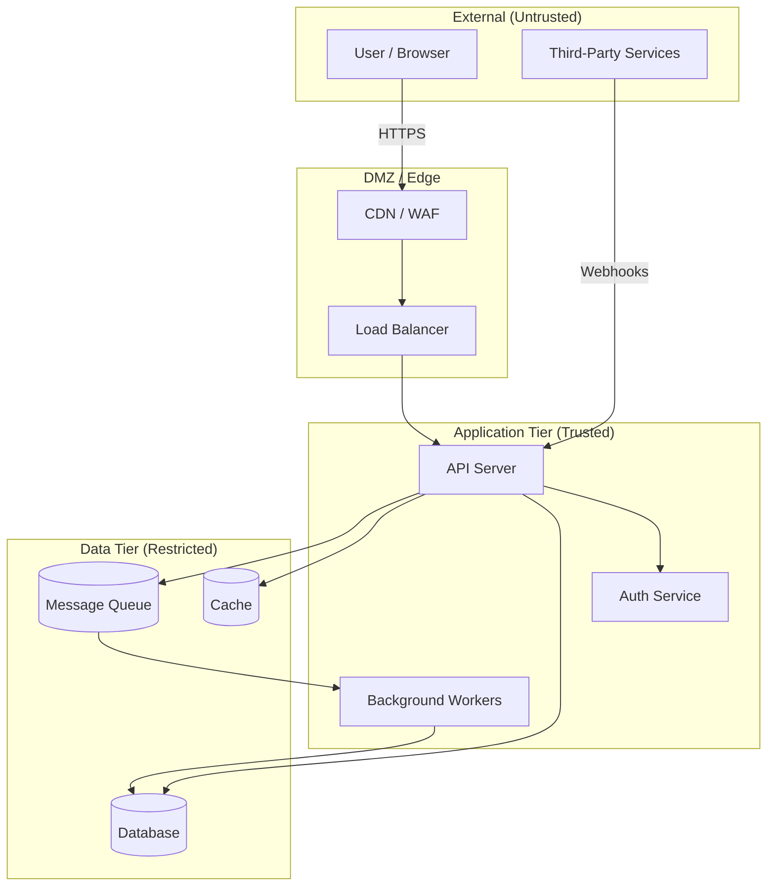

# Threat Model: {{project_name}}

**Author:** {{user_name}} + Forte (Security Engineer)
**Date:** {{date}}
**Version:** {{version}}
**Status:** Draft

---

## 1. System Overview

### 1.1 Components

_List all system components subject to threat analysis._

| Component | Type | Description | Exposure |
|---|---|---|---|
| | | | Internal / External / Public |

### 1.2 Data Flows

_Describe how data moves between components, including protocols and data sensitivity._

| Flow ID | Source | Destination | Data | Protocol | Sensitivity |
|---|---|---|---|---|---|
| DF-01 | | | | | |

### 1.3 Trust Boundaries

_Identify where trust levels change — these are the most critical points for attack._

| Boundary ID | Description | Components Separated | Trust Level Change |
|---|---|---|---|
| TB-01 | | | |

---

## 2. Trust Boundary Diagram



_Update this diagram to reflect the actual system architecture. Each boundary crossing is a potential attack surface._

---

## 3. STRIDE Analysis

### 3.1 Analysis Summary

| Threat Category | Total Threats | Critical | High | Medium | Low |
|---|---|---|---|---|---|
| **S**poofing | | | | | |
| **T**ampering | | | | | |
| **R**epudiation | | | | | |
| **I**nformation Disclosure | | | | | |
| **D**enial of Service | | | | | |
| **E**levation of Privilege | | | | | |
| **Total** | | | | | |

### 3.2 Detailed STRIDE Analysis

#### Spoofing (Identity)

_Threats where an attacker pretends to be something or someone they are not._

| ID | Component | Threat | Severity | Likelihood | Impact | Mitigation |
|---|---|---|---|---|---|---|
| S-01 | | | | | | |

#### Tampering (Integrity)

_Threats where an attacker modifies data or code without authorization._

| ID | Component | Threat | Severity | Likelihood | Impact | Mitigation |
|---|---|---|---|---|---|---|
| T-01 | | | | | | |

#### Repudiation (Accountability)

_Threats where an attacker denies performing an action without ability to prove otherwise._

| ID | Component | Threat | Severity | Likelihood | Impact | Mitigation |
|---|---|---|---|---|---|---|
| R-01 | | | | | | |

#### Information Disclosure (Confidentiality)

_Threats where sensitive data is exposed to unauthorized parties._

| ID | Component | Threat | Severity | Likelihood | Impact | Mitigation |
|---|---|---|---|---|---|---|
| I-01 | | | | | | |

#### Denial of Service (Availability)

_Threats where an attacker degrades or prevents legitimate access to the system._

| ID | Component | Threat | Severity | Likelihood | Impact | Mitigation |
|---|---|---|---|---|---|---|
| D-01 | | | | | | |

#### Elevation of Privilege (Authorization)

_Threats where an attacker gains capabilities beyond their authorized level._

| ID | Component | Threat | Severity | Likelihood | Impact | Mitigation |
|---|---|---|---|---|---|---|
| E-01 | | | | | | |

---

## 4. Attack Trees

_For each CRITICAL-severity threat, construct an attack tree showing how an attacker could achieve the goal._

### Attack Tree: [Critical Threat Title]

```
Goal: [Attacker objective]
|
+-- AND/OR: [Precondition or alternative path]
|   |
|   +-- [Sub-step 1] (Likelihood: X, Effort: Y)
|   +-- [Sub-step 2] (Likelihood: X, Effort: Y)
|
+-- AND/OR: [Alternative attack path]
    |
    +-- [Sub-step 1] (Likelihood: X, Effort: Y)
```

**Assessment:** [Feasibility, required attacker capabilities, detection opportunities]

---

## 5. Data Classification

| Data Element | Classification | Storage Location | Protection Requirements |
|---|---|---|---|
| | PUBLIC / INTERNAL / CONFIDENTIAL / RESTRICTED | | |

### 5.1 Sensitivity Levels

- **PUBLIC:** No protection required. Freely shareable.
- **INTERNAL:** Not for public consumption. Basic access controls.
- **CONFIDENTIAL:** Business-sensitive. Encryption at rest and in transit. Access logging.
- **RESTRICTED:** PII, credentials, financial data. Encryption, strict access controls, audit trails, retention policies.

### 5.2 PII Inventory

| Data Field | PII Type | Regulation | Retention | Anonymization Strategy |
|---|---|---|---|---|
| | Direct / Quasi / Sensitive | GDPR / CCPA / HIPAA | | |

---

## 6. Recommended Security Controls

### 6.1 Authentication & Identity

| Control | Priority | Status | Notes |
|---|---|---|---|
| Multi-factor authentication | | Not Started | |
| Session management | | Not Started | |
| Password policy enforcement | | Not Started | |
| OAuth / OIDC integration | | Not Started | |

### 6.2 Authorization & Access Control

| Control | Priority | Status | Notes |
|---|---|---|---|
| Role-based access control (RBAC) | | Not Started | |
| Resource-level permissions | | Not Started | |
| API key scoping | | Not Started | |
| Least privilege enforcement | | Not Started | |

### 6.3 Data Protection

| Control | Priority | Status | Notes |
|---|---|---|---|
| Encryption at rest (AES-256) | | Not Started | |
| Encryption in transit (TLS 1.3) | | Not Started | |
| Field-level encryption for secrets | | Not Started | |
| Secure key management | | Not Started | |
| Data masking / anonymization | | Not Started | |

### 6.4 Network Security

| Control | Priority | Status | Notes |
|---|---|---|---|
| WAF / DDoS protection | | Not Started | |
| Rate limiting | | Not Started | |
| CORS configuration | | Not Started | |
| CSP headers | | Not Started | |
| Network segmentation | | Not Started | |

### 6.5 Monitoring & Incident Response

| Control | Priority | Status | Notes |
|---|---|---|---|
| Security event logging | | Not Started | |
| Intrusion detection | | Not Started | |
| Anomaly alerting | | Not Started | |
| Incident response runbook | | Not Started | |
| Audit trail for sensitive operations | | Not Started | |

### 6.6 Supply Chain & Build Security

| Control | Priority | Status | Notes |
|---|---|---|---|
| Dependency vulnerability scanning | | Not Started | |
| SBOM generation | | Not Started | |
| Signed commits / releases | | Not Started | |
| CI/CD pipeline hardening | | Not Started | |
| Container image scanning | | Not Started | |

---

## 7. Compliance Considerations

| Regulation / Standard | Applicable | Key Requirements | Gap Assessment |
|---|---|---|---|
| OWASP Top 10 | Yes | See findings mapped in audit | |
| GDPR | | Data protection, right to erasure, consent | |
| CCPA | | Consumer data rights, opt-out | |
| SOC 2 | | Security, availability, confidentiality | |
| HIPAA | | PHI protection, access controls, audit | |
| PCI DSS | | Cardholder data protection, network security | |

---

## 8. Open Questions and Assumptions

### Open Questions

| ID | Question | Impact | Owner | Status |
|---|---|---|---|---|
| Q-01 | | | | Open |

### Assumptions

| ID | Assumption | Risk if Invalid | Validation Plan |
|---|---|---|---|
| A-01 | | | |

---

## Revision History

| Version | Date | Author | Changes |
|---|---|---|---|
| 1.0 | {{date}} | Forte (Security) | Initial threat model |
